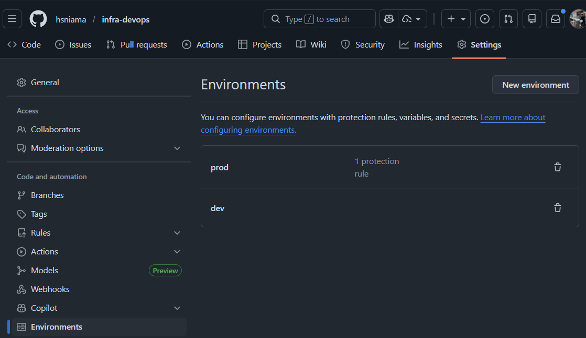
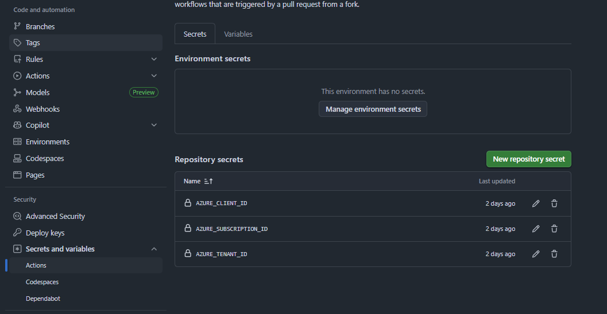
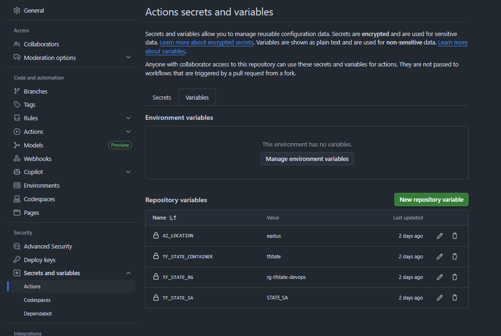
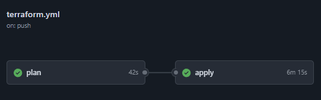

# Repo: infra-devops (Terraform + GitHub Actions + Azure + OIDC)

### Repositorio - `infra-devops` 

Este repositorio aprovisiona la infraestructura requerida para la aplicación que está en el repo [https://github.com/hsniama/app-devops](https://github.com/hsniama/app-devops):

- Azure Resource Group
- Azure Container Registry (ACR)
- Azure Kubernetes Service (AKS) con 2 nodos
- Redes (VNets/Subnets)
- Permisos AcrPull para la identidad kubelet de AKS
- Creación de App Registration, Service Principal y Federated creds.
- Estado remoto de Terraform almacenado en Azure Storage (autenticación con Azure AD)


### Infraestructura en Azure 
- **Región**: `eastus` 
- **State (backend)**: 
  - resource_group_name: `rg-tfstate-devops`
    - storage_account_name: `sttfstate2e9f0a4f`
        - container_name:        `tfstate`
            - keys (states separados por ambiente dentro del mismo backend)
                - `dev/infra.tfstate`
                - `prod/infra.tfstate`
- **Infraestructura dev**:
    - resource_group_name: `rg-devops-dev`
        - VNet: `vnet-devops-dev`
            - Azure Container Registry (ACR): `acrdevops1720dev`
            - Azure Kubernetes Service (AKS): `aksdevops1720dev`

- **Infraestructura prod**: `
    - resource_group_name: `rg-devops-prod`
        - VNet: `vnet-devops-prod`
            - Azure Container Registry (ACR): `acrdevops1720prod`
            - Azure Kubernetes Service (AKS): `aksdevops1720prod`

### Costos estimados 
- **AKS**: mínimo 2 nodos requeridos Tipo: `Standard_D2_v3` *(no tan económico)* 
- **ACR**: nivel `Basic` 

### Entornos
- **DEV**: cualquier push a ramas `dev/**` despliega en DEV
- **PROD**: merges/pushes a `main` despliegan en PROD (se recomienda mantener habilitada la aprobación de GitHub Environment)

Nota: El estado remoto de Terraform usa llaves separadas:
- `dev/infra.tfstate`
- `prod/infra.tfstate`

### Setup del proyecto

**0. Clonar el repo:**
```bash
git clone https://github.com/hsniama/infra-devops
cd infra-devops
```
**1. Loguearse a una suscripción activa con Azure y ejecutar los siguientes comandos:**
```bash
az login
```
```bash
az account set --subscription "PONER_TU_SUBSCRIPTION_NAME_O_ID"
```
```bash
SUBSCRIPTION_ID="$(az account show --query id -o tsv)"
TENANT_ID="$(az account show --query tenantId -o tsv)"

echo "$SUBSCRIPTION_ID"
echo "$TENANT_ID"

```
**2. Ejecutar el bootstrap de creación del backend remoto de Terraform en Azure:**

Primero dar permisos al archivo:
```bash
chmod +x scripts/bootstrap-backend.sh
```
Después ejecutarlo:
```bash
./scripts/bootstrap-backend.sh
```
Nota: Este Script crea los recursos del **State (backend)** mencionados arriba.


**3. Configuración de Environments en GitHub**

Se crea los environments en el repo > settings > Environments:
- `dev` 
- `prod`: Se activa el "Required reviewers para que prod no aplique sin aprobación.




**4. Creación del APP Registration + Service principal**

Este script automatiza la integración entre *GitHub Actions* y *Azure*: 
- Crea una App Registration y Service Principal en Azure AD. 
- Asigna permisos de *Owner* en la suscripción y *Storage Blob Data Contributor* al Storage Account del tfstate. 
- Configura credenciales federadas para los entornos `dev` y `prod` en GitHub. 
- Devuelve los valores necesarios para guardar en *GitHub Secrets* (`AZURE_CLIENT_ID`, `AZURE_TENANT_ID`, `AZURE_SUBSCRIPTION_ID`).

Primero dar permisos al archivo:
```bash
chmod +x scripts/bootstrap-oidc.sh
```
Después ejecutarlo:
```bash
./scripts/bootstrap-oidc.sh
```

**5. Creación de Secrets en GitHub**

Crear los siguientes Secrets con sus respectivos valores en repo > settings > secrets & variables > actions > secrets

- AZURE_CLIENT_ID
- AZURE_TENANT_ID
- AZURE_SUBSCRIPTION_ID



Y en Actions > Variables, crear las siguientes:

- AZ_LOCATION
- TF_STATE_CONTAINER
- TF_STATE_RG
- TF_STATE_SA




### Ejecución de Pipeline

Se tiene el `.github/workflows/terraform.yml`:



Resultado:
- Push a `dev/**` -> Se despliega en el ambiente de DEV.
- PR para merge desde `dev/**` a `main` -> Se despliega en el ambiente de PROD.


### Outputs de Terraform 
*Estos Outputs son necesarios para el repositorio de la aplicación.*

Después de que el workflow finalice, revisa los logs del job **apply** (step: Show Terraform outputs), se necesitará los siguientes valores para el repositorio de microservicios [https://github.com/hsniama/app-devops](https://github.com/hsniama/app-devops):

- `resource_group_name`
- `aks_name`
- `acr_name`
- `acr_login_server`

### Limpieza
- La infraestructura de DEV puede destruirse usando/ejecutando el workflow manual: `destroy-dev.yml`
- La infraestructura de PROD puede destruirse usando/ejecutando el workflow manual: `destroy-prod.yml`
- El backend de Terraform (almacenamiento del estado) puede eliminarse usando: `scripts/destroy-backend.sh`
