# Repo: infra-devops (Terraform + GitHub Actions + Azure + OIDC)

## Repositorio - `infra-devops` 

Este repositorio aprovisiona la infraestructura requerida para la aplicación que está en el repo [https://github.com/hsniama/app-devops](https://github.com/hsniama/app-devops):

- Azure Resource Group
- Azure Container Registry (ACR)
- Azure Kubernetes Service (AKS) con 2 nodos
- Redes (VNets/Subnets)
- Permisos AcrPull para la identidad kubelet de AKS
- Creación de App Registration, Service Principal y Federated creds.
- Estado remoto de Terraform almacenado en Azure Storage (autenticación con Azure AD)

## Infraestructura en Azure 
- **Región**: `eastus` 
- **State (backend)**: 
  - resource_group_name: `rg-tfstate-devops`
    - storage_account_name: `sttfstate2e9f0a4f`
        - container_name:        `tfstate`
            - keys (states separados por ambiente dentro del mismo backend)
                - `dev/infra.tfstate`
                - `prod/infra.tfstate`

  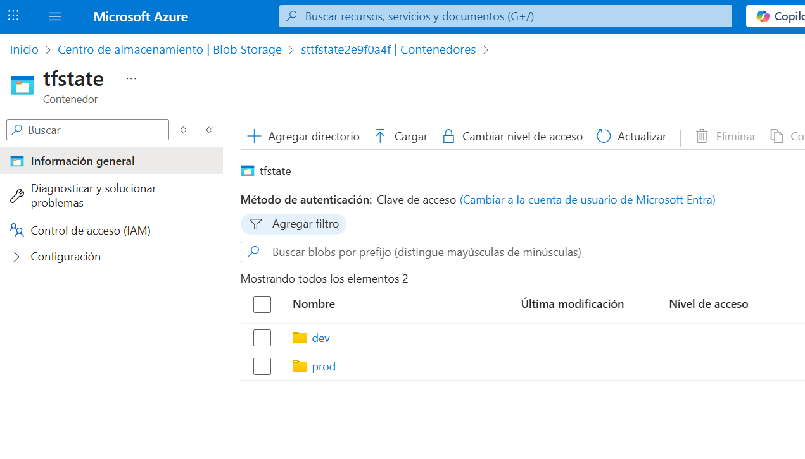

- **Infraestructura dev**:
    - resource_group_name: `rg-devops-dev`
        - VNet: `vnet-devops-dev`
            - Azure Container Registry (ACR): `acrdevops1720dev`
            - Azure Kubernetes Service (AKS): `aksdevops1720dev`

    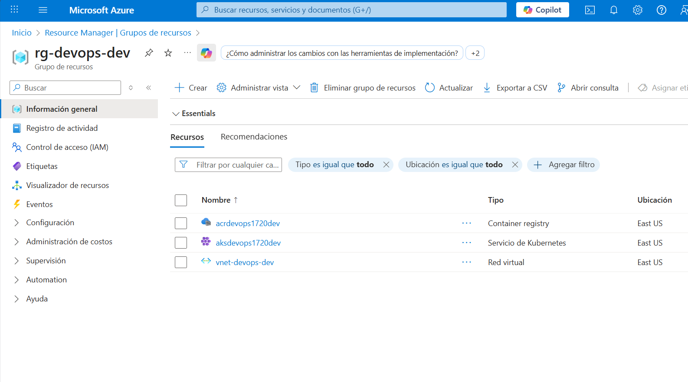

- **Infraestructura prod**:
    - resource_group_name: `rg-devops-prod`
        - VNet: `vnet-devops-prod`
            - Azure Container Registry (ACR): `acrdevops1720prod`
            - Azure Kubernetes Service (AKS): `aksdevops1720prod`

    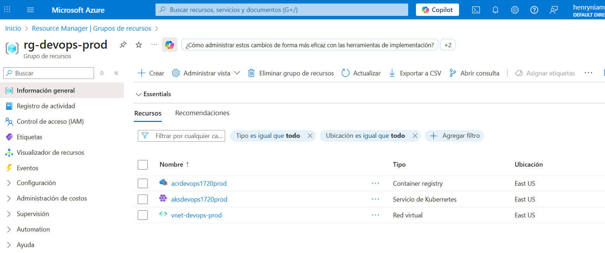

## Costos estimados 
- **AKS**: mínimo 2 nodos requeridos Tipo: `Standard_D2_v3` *(no tan económico)* 
- **ACR**: nivel `Basic` 

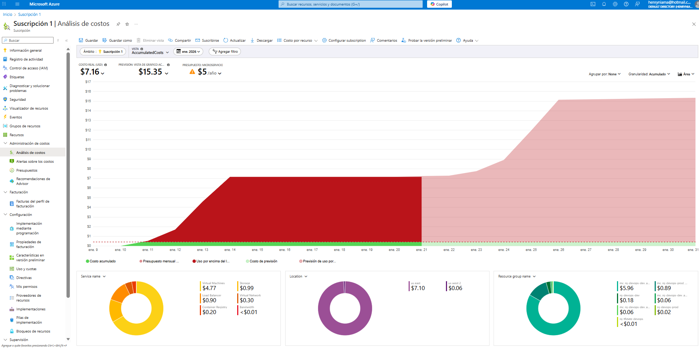

## Entornos

Se tiene 2 entornos para este proyecto:

- **DEV**: cualquier push a ramas `dev/**` despliega en DEV
- **PROD**: merge a `main` despliegan en PROD (se recomienda mantener habilitada la aprobación de GitHub Environment)

El estado remoto de Terraform usa llaves separadas pero mismo Storage Account:

- `dev/infra.tfstate`

   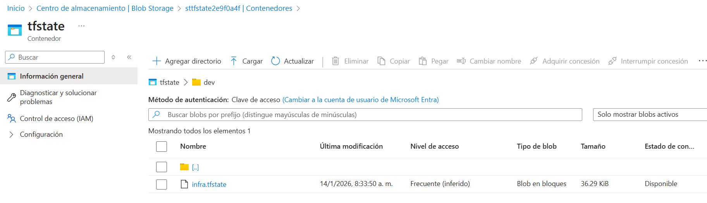
    Ir al archivo [backends/dev.hcl](./backends/dev.hcl)

- `prod/infra.tfstate`

   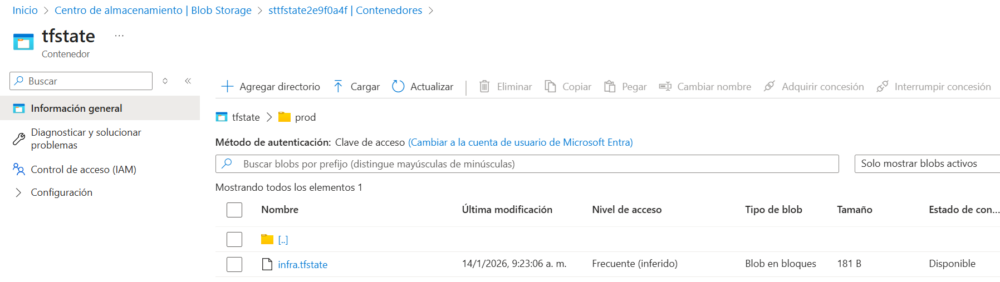
    Ir al archivo [backends/prod.hcl](./backends/prod.hcl)

## Setup del proyecto

**0. Clonar el repo:**
```bash
git clone https://github.com/hsniama/infra-devops
cd infra-devops
```
**1. Loguearse a una suscripción activa con Azure y ejecutar los siguientes comandos:**
```bash
az login
```
```bash
az account set --subscription "PONER_TU_SUBSCRIPTION_NAME_O_ID"
```
```bash
SUBSCRIPTION_ID="$(az account show --query id -o tsv)"
TENANT_ID="$(az account show --query tenantId -o tsv)"

echo "$SUBSCRIPTION_ID"
echo "$TENANT_ID"

```
**2. Ejecutar el script de creación del State Backend remoto de Terraform en Azure:**

Este script crea y deja listos estos recursos en *Azure*:
- Resource Group → `rg-tfstate-devops` (o el que definas).
- Storage Account → nombre único tipo `sttfstateXXXX`.
- Blob Container → `tfstate`.
- Versionado de blobs activado.

Primero dar permisos al archivo:
```bash
chmod +x scripts/bootstrap-backend.sh
```
Después ejecutarlo:
```bash
./scripts/bootstrap-backend.sh
```
Al final de la ejecución del script, este imprime las siguientes variables del backend en Terraform:
- `STATE_RG=rg-tfstate-devops`
- `STATE_SA=sttfstateXXXX`
- `STATE_CONTAINER=tfstate`

Nota: Estas variables se deben setear en el backend HCL y en GitHub Variables del repositorio así que guardarlas.

Setearlas manualmente en el archivo backends/dev.hcl
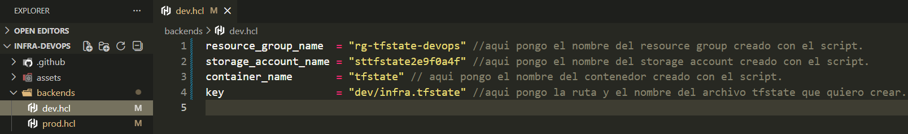

Setearlas manualmente en el archivo backends/prod.hcl
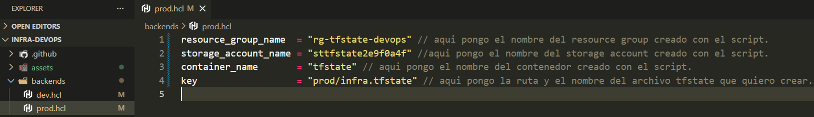

En el punto 6 se indica como guardar estas variables en el repositorio de GitHub.

**3. Configuración de Environments en GitHub**

Se crea los environments en el repo > settings > Environments:
- `dev` 
- `prod`: Se activa el "Required reviewers" para que prod no aplique sin aprobación.


**4. Creación del APP Registration + Service principal**

Este script habilita la autenticación segura de *GitHub Actions* contra *Azure* usando OIDC, con permisos suficientes para manejar infraestructura y el backend de Terraform.

Después de ejecutar el script se crea:
- Una App Registration en Azure AD (gh-oidc-infra-devops).
- Un Service Principal que:
    - Asigna permisos de *Owner* en la suscripción.
    - Asigna permisos de *Storage Blob Data Contributor* en el Storage Account del `tfstate`.
- Dos credenciales federadas OIDC para los entornos `dev` y `prod` del repo en GitHub.

Primero dar permisos al archivo:
```bash
chmod +x scripts/bootstrap-oidc.sh
```
Después ejecutarlo:
```bash
./scripts/bootstrap-oidc.sh
```

Al final, imprime las variables necesarias para *GitHub Secrets* (debes guardarlas):
- `AZURE_CLIENT_ID` → el APP_ID de la aplicación.
- `AZURE_TENANT_ID` → el Tenant ID de tu Azure AD.
- `AZURE_SUBSCRIPTION_ID` → el ID de la suscripción.

**5. Creación de Secrets en GitHub**

Crear los siguientes Secrets (obtenidas en el anterior paso) con sus respectivos valores en repo > settings > secrets & variables > actions > secrets


**6. Creación de Variables en GitHub**

En Actions > Variables, crear las siguientes:

- `AZ_LOCATION` → eastus
- `TF_STATE_CONTAINER` → tfstate
- `TF_STATE_RG` → rg-tfstate-devops
- `TF_STATE_SA` → sttfstateXXXX


**7. Setear el nombre del ACR**

El nombre del Azure Container Registry (ACR) debe ser único a nivel global en Azure. Por ende, se debe poner un nombre único para cada ambiente.

Para `DEV` modificar el *acr_name* en el archivo `enviroments/dev.tfvars`

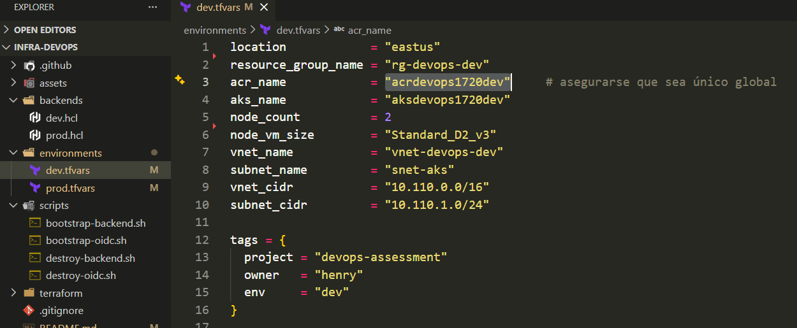

Para `PROD` modificar el *acr_name* en el archivo `enviroments/prod.tfvars`


## Ejecución de Pipeline

Se tiene dos fases en el `.github/workflows/terraform.yml`:


Resultado:
- Push a `dev/**` -> Se despliega en el ambiente de DEV.
- PR para merge desde `dev/**` a `main` -> Se despliega en el ambiente de PROD con una aprobación en la fase `apply`.

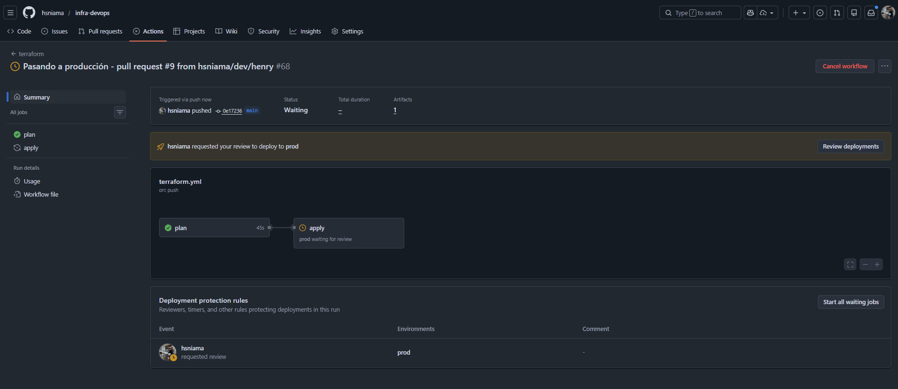

Ver el Pipeline en [.github/workflows/terraform.yml](./.github/workflows/terraform.yml.github/workflows/terraform.yml)

## Outputs de Terraform 
*Estos Outputs son necesarios para el repositorio de la aplicación.*

Después de que el workflow finalice correctamente, revisa los logs del job **apply** (step: Show Terraform outputs), se necesitará los siguientes valores (de acuerdo al ambiente) para el repositorio de microservicios [https://github.com/hsniama/app-devops](https://github.com/hsniama/app-devops):

- `resource_group_name`
- `aks_name`
- `acr_name`
- `acr_login_server`

## Limpieza
- La infraestructura de DEV puede destruirse usando/ejecutando el workflow manual: `./.github/workflows/destroy-dev.yml`
- La infraestructura de PROD puede destruirse usando/ejecutando el workflow manual: `./.github/workflows/destroy-prod.yml`
- El backend de Terraform (almacenamiento del estado) puede eliminarse usando: `./scripts/destroy-backend.sh`

## Anexos

Todos los grupos de Recursos:
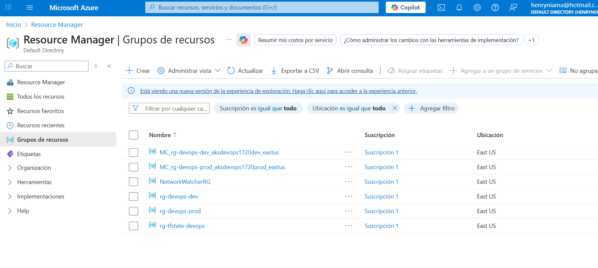

Los dos AKS Clusters de cada ambiente:
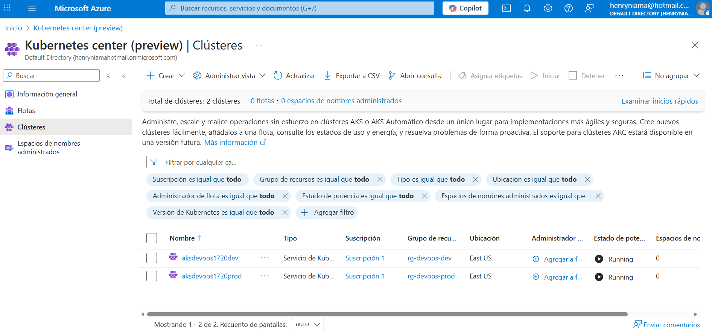